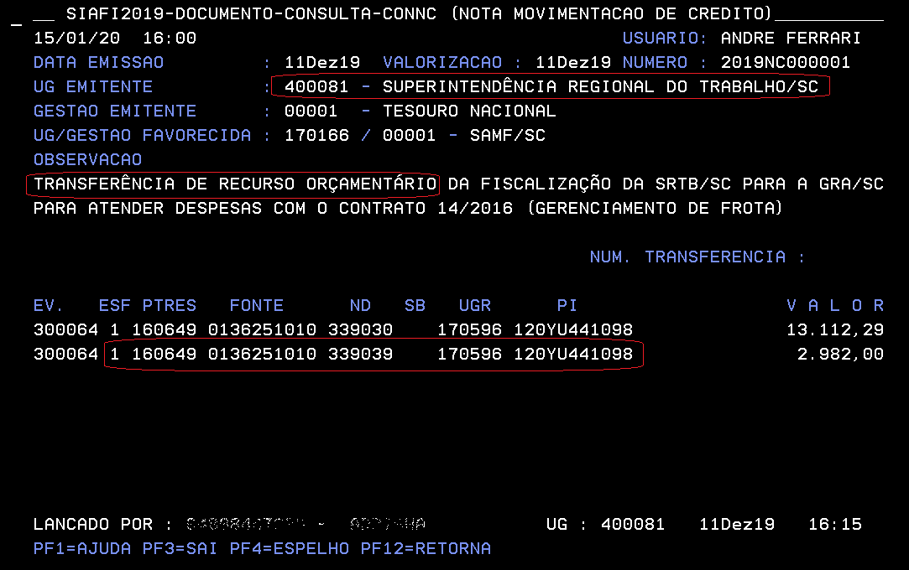
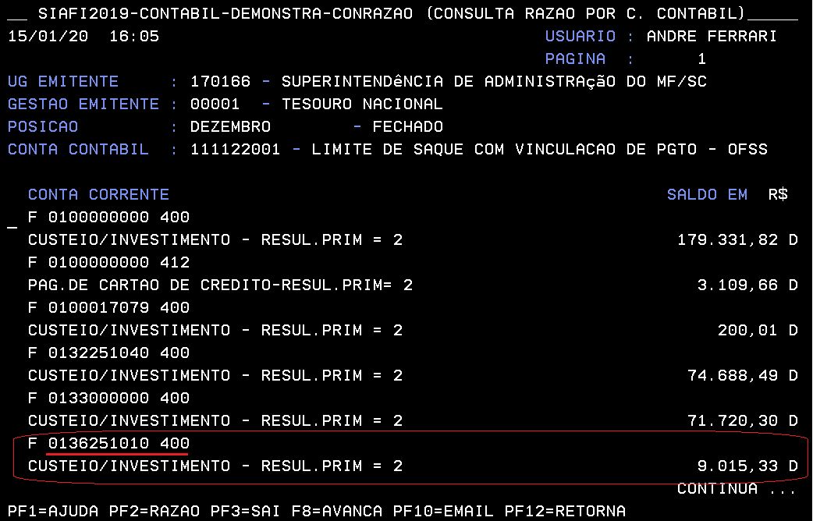
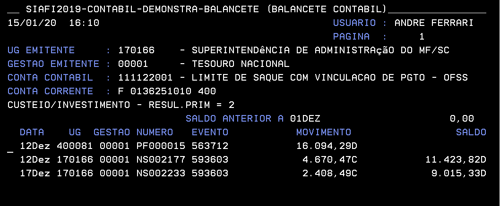
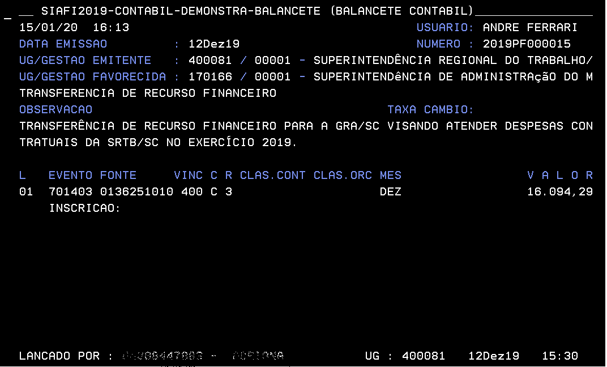

```{r setup, include=FALSE}
knitr::opts_chunk$set(echo = TRUE)
options(scipen=999)
options(digits = 4)
```


```{r, message=FALSE}
library(flexdashboard)
library(readxl)
library(ggplot2)
library(stringr)
library(plotly)
library(DT)
library(flexdashboard)
library(knitr)
library(shiny)
library(shinyWidgets)
library(lubridate)
library(tidyverse)
library(googledrive)
```
A nossa meta é automatizar a prestação de contas da Gerência Regional de Administração do Ministério da Economia em Santa Catarina, GRA/SC, referente à utilização dos recursos orçamentários e financeiros.

A GRA/SC gere a atividade meio de algumas unidades administrativas do poder executivo federal localizadas no estado de Santa Catarina. Por exemplo, a GRA/SC recebe via Nota de Crédito (NC) recursos orçamentários para contratar serviço de vigilância para as unidades estaduais da CGU, PGFN, SPU, SRTb (nossos clientes). Ao longo do ano, a GRA/SC também recebe via Nota de Programação Financeira (PF) os recursos financeiros para pagar as faturas deste serviço de vigilância.

Vamos iniciar importando os dados:
```{r, importar as tabelas}
# dados obtidos via Tesouro Gerencial
# importar as tabelas com os saldos:

# Item de Informação: Crédito Disponível (19)
credito <- read_excel("cred.xlsx")

colnames(credito)<-c("ano","org_uo_cod", "org_uo", "uo_cod", "uo", "ugr_cod", "ugr", "cc", "PTRES", "nd_cod", "nd", "fonte_cod", "fonte","pi_cod","pi", "ug_emit_cod", "ug_emit", "fav_cod", "fav", "fav_tipo_cod", "fav_tipo", "data_emi", "doc_tipo", "ug_lanca", "data_lan", "hora_acesso", "doc", "obs", "credito")


credito<- credito%>%
  mutate ( ug_ug = if_else(fav_tipo_cod == "UG",str_c(ug_emit_cod,fav_cod,ug_emit,fav),""))%>%
  mutate (ug_cliente = str_replace(ug_ug, "SUPERINTENDENCIA DE ADMINISTRACAO DO MF/SC",""))%>%
  mutate (ug_cliente = str_replace(ug_cliente, "170166",""))

credito_teste<- credito%>% filter (ugr_cod == "170166")%>%
  select(cc, doc, credito, ug_cliente)%>%
  group_by(cc)%>%
  summarise(ug_teste = max (ug_cliente))


credito<- credito%>% 
  group_by(cc)%>%
  mutate(ug_teste = max (ug_cliente))

credito_teste_nd_dd<- credito%>% filter (credito>0)%>%
  select(cc, doc, credito, ug_cliente)%>%
  group_by(cc)%>%
  summarise(ug_cliente = max(ug_cliente))


credito_teste_nd_cc<- credito%>% filter (credito<0)%>%
  select(cc, doc, credito, ug_cliente)%>%
  group_by(cc)%>%
  summarise(ug_cliente = max(ug_cliente))


credito_teste2<- credito%>% 
  select(cc, doc, credito, ug_cliente)%>%
  group_by(cc, ug_cliente)%>%
  summarise(saldo = sum (credito))

credito_pp<- full_join (credito, credito_teste)%>%
  group_by(ano, ug_teste, cc)%>%
  summarise(saldo = round( sum (credito),3))

teste<- credito%>%
  filter (ano == "2019")%>%
  group_by (ug_teste, cc)%>%
  summarise (saldo = round(sum (credito),4))

(sum(credito_pp$saldo))

# Item de Informação: LIMITES DE SAQUE (OFSS, DIVIDA, BACEN E PREV) (71)
limite <- read_excel("limite.xlsx")

# Item de Informação: PAGAMENTOS TOTAIS (EXERCICIO E RAP) (56) 
pago <- read_excel("pago.xlsx")

#pago<- pago%>% filter (uo_cod = "25103")

# Contas Contábies: RECEBIMENTO DE REPASSE A PROGR POR DESC EXT (822221201) e RECEBIMENTO DE SUB-REPASSE A PROGRAMAR (822230100)
repasse <- read_excel("repasse.xlsx")

# Contas Contábies: EXECUCAO DE PAGAMENTOS EFETUADOS (891100000) 
efetuados <- read_excel("total_pago.xlsx")

neccor<- data.frame("neccor" = unique(pago$neccor))
write.table(neccor, "C:/Users/03092181794/Desktop/R/diofi/neccor.txt", sep="\t")
```

Agora vamos apresentar os pagentos realizados pela GRA/SC
```{r, visão geral GRA/SC}


p_pago<- ggplot() + 
  
  geom_col(data = pago%>% 
             filter(ano == "2019")%>%
             group_by(ndd)%>%
              summarise(saldo = round(sum(pago),2))%>%
              top_n(10), aes(x = reorder(ndd,  saldo), y=saldo),
              position="dodge", color='skyblue',fill='steelblue')+
              coord_flip()

p_pago<-ggplotly(p_pago) %>%
  layout(showlegend = FALSE)%>%
  layout(xaxis = list( title = "", showline = FALSE, showgrid = FALSE ),
         yaxis = list ( title = "", showline = FALSE, showgrid = FALSE ))
p_pago
```


```{r}


p_pago<- ggplot() + 
  
  geom_col(data = pago%>% filter(ano == "2019")%>%
  group_by(org_uo)%>%
  summarise(saldo = round(sum(pago),2)),
  aes(x = reorder(org_uo,  saldo), y=saldo),
  position="dodge", color='red',fill='red')+
  coord_flip()

p_pago<-ggplotly(p_pago) %>%
  layout(showlegend = FALSE)%>%
  layout(xaxis = list( title = "", showline = FALSE, showgrid = FALSE ),
         yaxis = list ( title = "", showline = FALSE, showgrid = FALSE ))
p_pago
```

```{r}
p_pago<- ggplot() + 
  
  geom_col(data = pago%>% filter(ano == "2019", org_uo_cod == "25000")%>%
  group_by(uo)%>%
  summarise(saldo = round(sum(pago),2)),
  aes(x = reorder(uo,  saldo), y=saldo),
  position="dodge", color='red',fill='red')+
  coord_flip()

p_pago<-ggplotly(p_pago) %>%
  layout(showlegend = FALSE)%>%
  layout(xaxis = list( title = "", showline = FALSE, showgrid = FALSE ),
         yaxis = list ( title = "", showline = FALSE, showgrid = FALSE ))
p_pago
```


A complexidade da prestação de contas é proporcional ao número de clientes e a quantidade de fontes de recursos. Tudo estaria resolvido se cada cliente tivesse a sua própria fonte. No nosso caso, o desafio é controlar a fonte 0100000000 (recursos ordinários), pois vários clientes repassam recursos nessa fonte.


***
#### Descentralização de Crédito Orçamentário (NC)


 


***
#### Balancete: Limite de Saque

  
                                                                   
***                                                                  
                                                                   
  


   
   
***  
  

                                                            
                                                                               
Identificar os clientes


```{r}


repasse_nc <- repasse %>%
  # somente nota de crédito
  filter(doc_tipo == "NC")%>%
  # somente se favorecido for UG concatenar código e nome da ug emitente e da ug favorecida
  # a movimentação de crédito ocorre tanto do cliente para a GRA quanto da GRA para o cliente
  mutate ( ug_ug = if_else(fav_tipo_cod == "UG",str_c(ug_emit_cod,fav_cod,ug_emit,fav),""))%>%
  # retirar o nome e o código da GRA e manter apenas o código/nome do cliente
  mutate (ug_cliente = str_replace(ug_ug, "SUPERINTENDENCIA DE ADMINISTRACAO DO MF/SC",""))%>%
  mutate (ug_cliente = str_replace(ug_cliente, "170166",""))


 # mesma rotina do repasse
credito_nc <- credito %>%
  filter(doc_tipo == "NC")%>%
  mutate ( ug_ug = if_else(fav_tipo_cod == "UG",str_c(ug_emit_cod,fav_cod,ug_emit,fav),""))%>%
  mutate (ug_cliente = str_replace(ug_ug, "SUPERINTENDENCIA DE ADMINISTRACAO DO MF/SC",""))%>%
  mutate (ug_cliente = str_replace(ug_cliente, "170166",""))

 # mesma rotina do repasse, apenas filtrar por "PF"
limite_pf <- limite %>%
  filter(doc_tipo == "PF")%>%
  mutate ( ug_ug = if_else(fav_tipo_cod == "UG",str_c(ug_emit_cod,fav_cod,ug_emit,fav),""))%>%
  mutate (ug_cliente = str_replace(ug_ug, "SUPERINTENDENCIA DE ADMINISTRACAO DO MF/SC",""))%>%
  mutate (ug_cliente = str_replace(ug_cliente, "170166",""))


(unique(limite$ug_cliente))

# verificar a consistência dos clientes
# selecionar clientes únicos do repasse, credito e limite
ll <- data.frame("ug_cliente_limite" = unique(limite_pf$ug_cliente))
rr <- data.frame("ug_cliente_repasse" = unique(repasse_nc$ug_cliente))
cc <- data.frame("ug_cliente_credito" = unique(credito_nc$ug_cliente))


# ordenar os clientes
ll<- arrange(ll, ug_cliente_limite)
rr<- arrange (rr, ug_cliente_repasse)
cc<- arrange (cc, ug_cliente_credito)

# verificar a igualdade
##ll_rr_cc <- do.call("cbind", list(cc,ll,rr))%>%
##  mutate (ok = if_else(ug_cliente_limite == ug_cliente_repasse & ug_cliente_repasse == ug_cliente_credito, "ok", "problema"  ))

## ll_rr_cc
```


```{r}
datatable(credito%>%
  group_by(ano,cc)%>%
  summarise(saldo = round(sum (credito),2)),
          filter = 'top', options = list(  pageLength = 25, autoWidth = TRUE, style = "default", width = 300))


datatable(pago%>%
  group_by(ano,neccor)%>%
  summarise(saldo = round(sum (pago),2)),
          filter = 'top', options = list(  pageLength = 5, autoWidth = TRUE, style = "default", width = 300))

pago_ne<- pago%>%
  group_by(neccor)%>%
  summarise(saldo = round(sum (pago),2))


credito_ne<- credito%>%
  filter(doc_tipo == "NE")%>%
  group_by(doc)%>%
  summarise(saldo = round(sum (credito),2))


credito_pago<- full_join(credito_ne, pago_ne, by = c("doc" = "neccor") )

```


```{r}


emit_cred <-credito%>%
  group_by(ano,ug_emit)%>%
  summarise(saldo = round(sum (credito),2))


emit_limite<-limite%>%
  group_by(ano,ug_emit)%>%
  summarise(saldo = round(sum (limite),2))

datatable(limite%>%
  group_by(ano,ug_emit)%>%
  summarise(saldo = round(sum (limite),2)),
          filter = 'top', options = list(  pageLength = 25, autoWidth = TRUE, style = "default", width = 300))


emitente <- full_join(emit_limite, emit_cred, by = "ug_emit")


datatable(repasse%>%
  group_by(ano,cc)%>%
  summarise(saldo = round(sum (repasse),2)),
          filter = 'top', options = list(  pageLength = 25, autoWidth = TRUE, style = "default", width = 300))

modelo_credito <- list (names(credito))
modelo_limite <- list (names(limite))
modelo_pago <- list (names(pago))
modelo_repasse <- list (names(repasse))
modelo<- list(modelo_repasse, modelo_credito, modelo_limite, modelo_pago)
modelo

```


```{r}


## detaorc
cc<-credito%>%
  filter(doc_tipo != "NC" , doc_tipo != "NE", ano == "2019", credito > 0)%>%
  select(ugr, cc, doc_tipo, ug_emit, credito, doc)%>%
  group_by(doc, cc )%>%
  summarise(saldo = sum (credito))


dd<-credito%>%
  filter(doc_tipo != "NC" , doc_tipo != "NE", ano == "2019", credito < 0)%>%
  select(ugr, cc, doc_tipo, ug_emit, credito, doc)%>%
  group_by(doc, cc )%>%
  summarise(saldo = sum (credito))
  


ddcc<- merge (cc,dd, by = "doc")


cc<-credito%>%
  filter(doc_tipo != "NC" , doc_tipo != "NE", ano == "2019", credito > 0)%>%
  select(ugr, cc, doc_tipo, ug_emit, credito, doc)%>%
  group_by(doc )%>%
  summarise(saldo = sum (credito))


dd<-credito%>%
  filter(doc_tipo != "NC" , doc_tipo != "NE", ano == "2019", credito < 0)%>%
  select(ugr, cc, doc_tipo, ug_emit, credito, doc)%>%
  group_by(doc )%>%
  summarise(saldo = sum (credito))
  


ddcc<- merge (cc,dd, by = "doc")


```


```{r}
cc<-credito%>%
  filter(credito > 0, ano == "2019")%>%
  select(cc, doc_tipo, ug_emit, credito, doc)%>%
  group_by(doc, cc , doc_tipo)%>%
  summarise(saldo = sum (credito))


dd<-credito%>%
  filter( credito < 0, ano == "2019")%>%
  select(ugr, cc, doc_tipo, ug_emit, credito, doc)%>%
  group_by(cc, doc, doc_tipo )%>%
  summarise(saldo = sum (credito))
  

tt<- neccor$neccor

ddcc<- merge (cc,dd, by = "cc")

ddccor<-ddcc%>% filter (doc.y %in% neccor$neccor, doc_tipo.x != "NC" )
(unique(ddcc$doc.x))

ddcc_nd<-ddcc%>% filter (doc.y %in% ddccor$doc.x, doc_tipo.x == "NC" )%>%
  select(doc.x)
(unique(ddcc_nd$doc.x))

nc_clientes <- c(unique(ddcc$doc.x),unique(ddcc_nd$doc.x))

final<-credito%>% filter (doc %in% nc_clientes,ano =="2019", ug_cliente != "")%>%
  group_by( PTRES, fonte_cod, nd_cod, ugr_cod, pi_cod)%>%
  summarise(saldo = round(as.numeric(sum (credito)),2))


```

